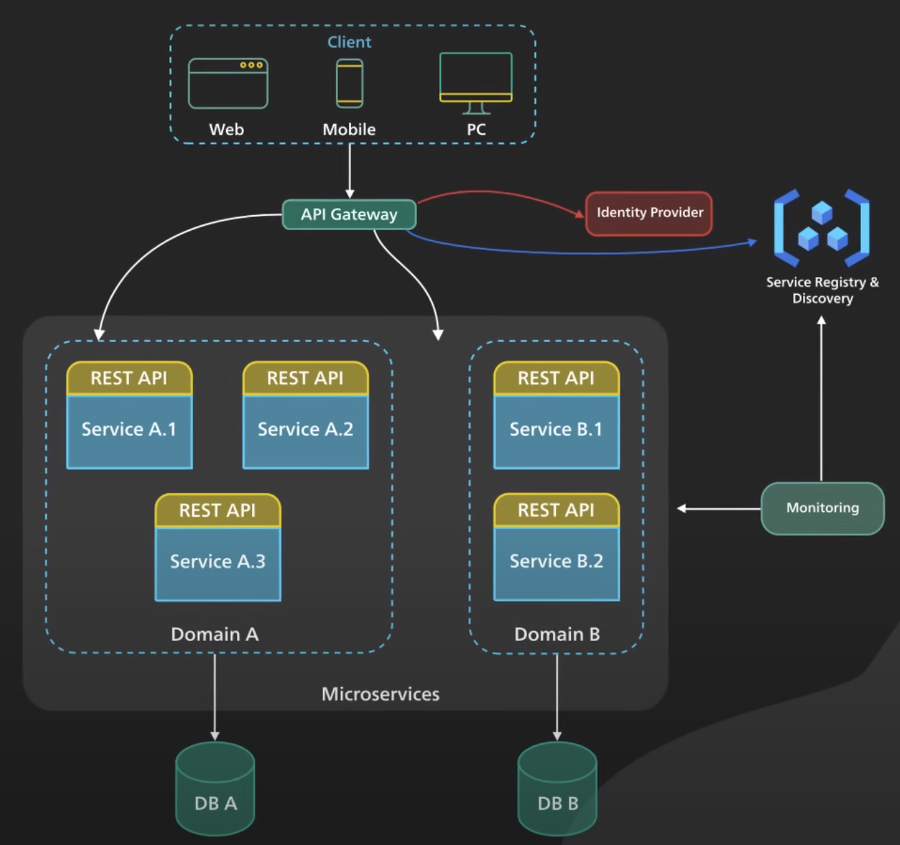
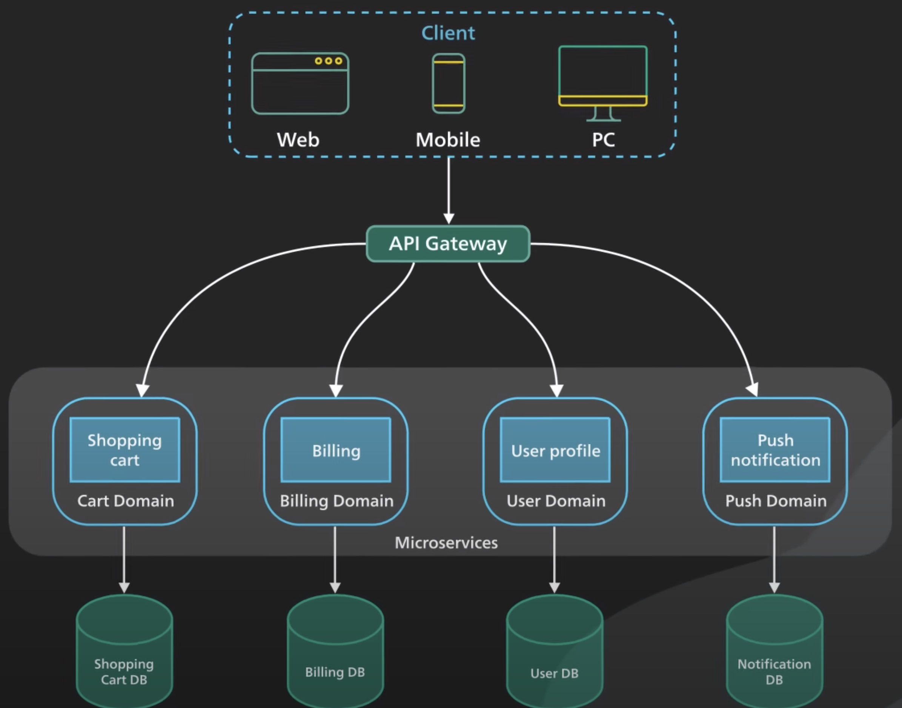
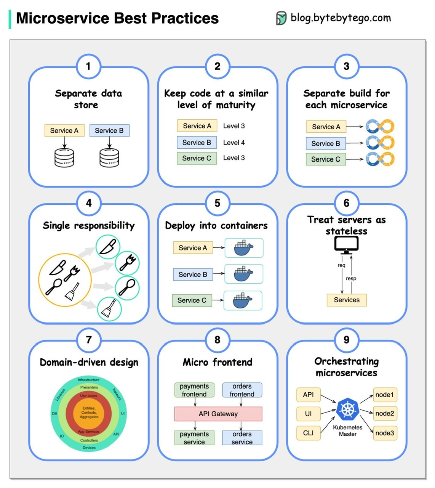

# Notes on Microservices

## Microservices Architecture

-   Microservices are loosely coupled
-   Each microservice handles a dedicated function inside a large-scale application
-   Microservices communicate with each other via well-defined interfaces
    -   The interfaces form a contract which dictate the the communication protocol and the type of data that can be transferred between the microservices
-   Methods of communications used by Microservices:
    -   RPC
    -   gRPC
    -   Event Streaming
    -   Message Brokers
    -   REST
-   Microservices can be independently deployed and can be scaled easily
-   Instead of using a monolithic database, microservices typically break up their database into functional areas (domains) and each microservice communicates with a corresponding database for the respective domain
    -   NOTE: This doesn't necessarily mean that each microservice has to host its own database.
        -   Can use a single database cluster with separate schemas for each microservice / domain
        -   Can also use separate databases, each for its own microservice / domain
    -   CAUTION: By breaking up a database (either into separate schemas or separate physical databases), it is more difficult (or impossible) to link the data between databases / schemas together (foreign key references are more difficult)
-   An API Gateway handles incoming requests and routes them to the relevant microservices
    -   The API Gateway relies on an identity provider service to handle authentication and authorization of each request coming through the API gateway

-   In the example above: - Each microservice belongs to its own functional area (domain)

## Microservices Best Practices

-   Use separate data storage for each microservice
-   Keep code at a similar level of maturity
-   Separate build for each microservice
-   Assign each microservice with a single responsibility
-   Deploy into containers
-   Design stateless services
-   Adopt domain-driven design
-   Design micro frontend
-   Orchestrating microservices

## Resources

-   [ByteByteGo - 9 best practices for developing microservices](https://blog.bytebytego.com/i/133823536/best-practices-for-developing-microservices)
-   [ByteByteGo - What are Microservices Really All About (And When Not To Use It)](https://www.youtube.com/watch?v=lTAcCNbJ7KE)
-   [TechWOrld with Nana - Microservices explained - the What, Why and How?](https://www.youtube.com/watch?v=rv4LlmLmVWk)
-   [REST APIs for Microservices? Beware!](https://www.youtube.com/watch?v=_4gyR6CBkUE)
-   [ByteByteGo - Top 7 Most-Used Distributed System Patterns](https://www.youtube.com/watch?v=nH4qjmP2KEE)
-   [freeCodeCamp - Microservice Architecture and System Design with Python & Kubernetes - Full Course](https://www.youtube.com/watch?v=hmkF77F9TLw)
-   [Les Jackson - .NET Microservices - Full Course](https://www.youtube.com/watch?v=DgVjEo3OGBI)
